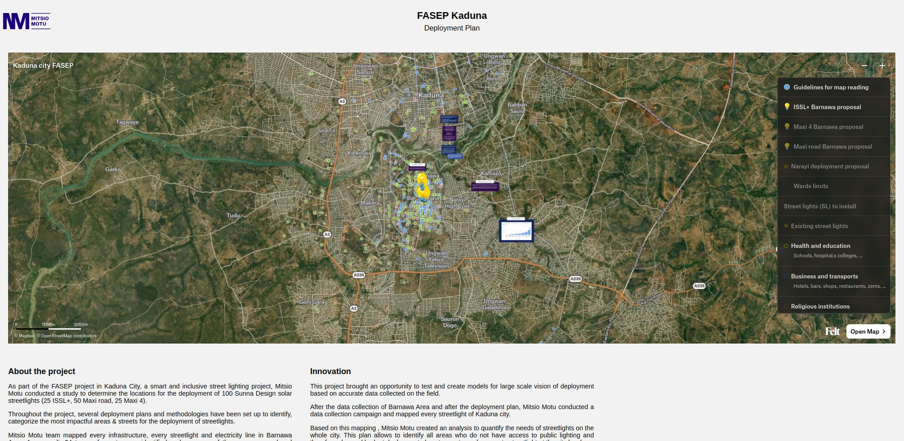

# fasep-kaduna

Ce dépôt permet de présenter via un [site internet](https://mitsio-motu-data.github.io/fasep-kaduna/)
une carte interactive
de Kaduna dans l'objectif d'installer des lampadaires dans la ville (visible
sur l'image ci-dessous).

À terme, ce site, doit être remplacé par une version bien plus complète et
aboutie, devant ressembler à ce
[figma](https://www.figma.com/file/p5xUnJawBNI4nOkif4cf78/Kaduna-City-FASEP-Website?type=design&node-id=0-1&mode=design&t=tmKFh9c4VSdLU50d-0).

